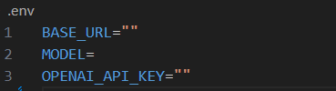
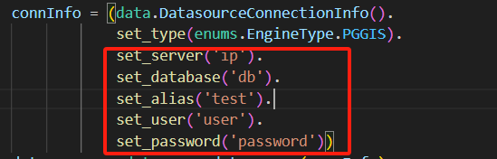

# SuperMapMCP

## 初始化环境

### 初始化supermap object java环境

在supermap官网下载object java 12.0版本组件，并下载使用许可，见bin设置到环境变量。

### 激活虚拟环境

source .venv/bin/activate # linunx等
.venv/bin/activate        # windows

## 修改配置文件

修改.env文件的内容为自己OpenAI对于内容

## 修改Server中数据库信息

需要用supermap组件或者桌面创建数据源！！

## 运行

uv run client.py server.py

